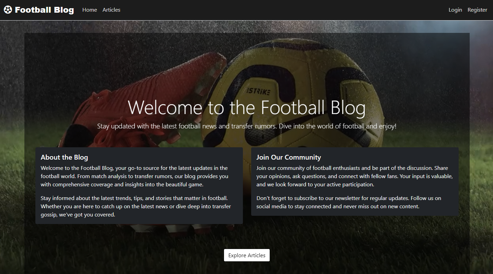
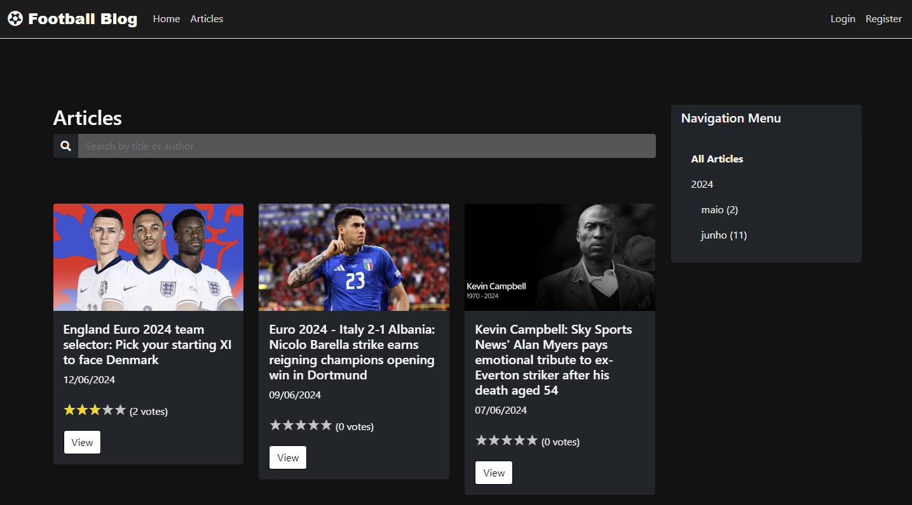
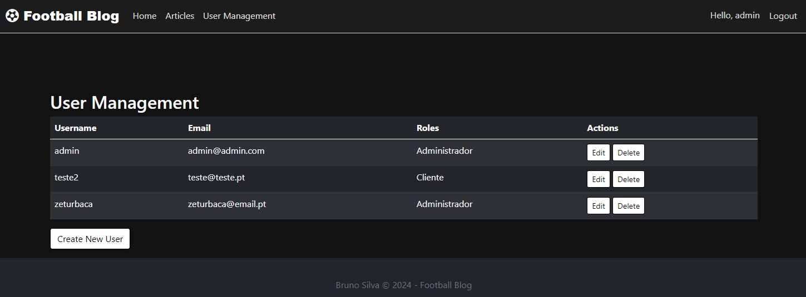

# Football News Blog

Welcome to the Football News Blog project! This application is built using ASP.NET MVC and provides a platform for football enthusiasts to read, rate, and comment on various football news articles. It includes a robust user management system, role-based access control, and a dynamic rating system for articles and comments.

## Features

- **Articles Management**
  - Create, read, update, and delete articles.
  - Articles can be public or restricted to logged-in users only.
  - Articles can include images and are authored with a publish date.
  - Users can rate articles on a scale from 1 to 5.

- **Comments System**
  - Users can comment on articles.
  - Comments include the user's name and the date they were created.
  - Comments are linked to specific articles.

- **User Roles and Authentication**
  - Admin and client roles with distinct permissions.
  - Admins can manage user roles and user information.
  - Users must log in to access certain features and restricted articles.

- **Rating System**
  - Articles and comments can be rated.
  - Ratings are aggregated to provide an overall score for each article.

- **User Management**
  - Admins can create, edit, and delete users.
  - Users can update their profile information.

## Instalation

- **Clone the repository**
git clone https://github.com/yourusername/football-news-blog.git

- **Navigate to the project directory**
cd football-news-blog

- **Restore the dependencies**
dotnet restore

- **Update the database connection string in `appsettings.json`**

- **Apply migrations to create the database**
dotnet ef database update

- **Run the application**
dotnet run
